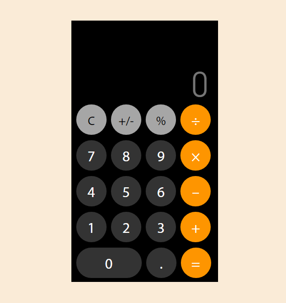

# Calculator on JS

## Документация для калькулятора на JavaScript.

Здесь будут представлены переменные и функции принцип работы которых труднее понять по мнению автора документации. (возможны изменения документации) 

### Переменные: 

- arr_numbers, переменная (массив) хранит в себе последовательность чисел и знаков (+,-,/,*)

- str_number, переменная (строка) хранит введенные числа с поле ввода

- save_number, переменная (строка) для хранения первого введенного числа

- sign, переменная (строка) хранит нажатый знак (оператор) на клавиатуре калькулятора

- sign_state, переменная (логический) хранить состояние (истина/ложь) нажатия знаков (оператор) на клавиаткре калькулятора

- equal_state, переменная (логический) хранит состояние нажатия на знак (=)

### Функциии:

- addNumberToArray, функция добавляет в переменную str_number число

- addSignToArray, функция при нажатии на знак (оператор) добавляет в массив число переменной str_number, затем знак после числа

- equal, функция выводит результат в зависимости от условии

- calc, функция производит вычисление в зависимости нажатого знака (оператора) на клавиатуре калькулятора

- clear, функция очищает поле ввода и переменные
